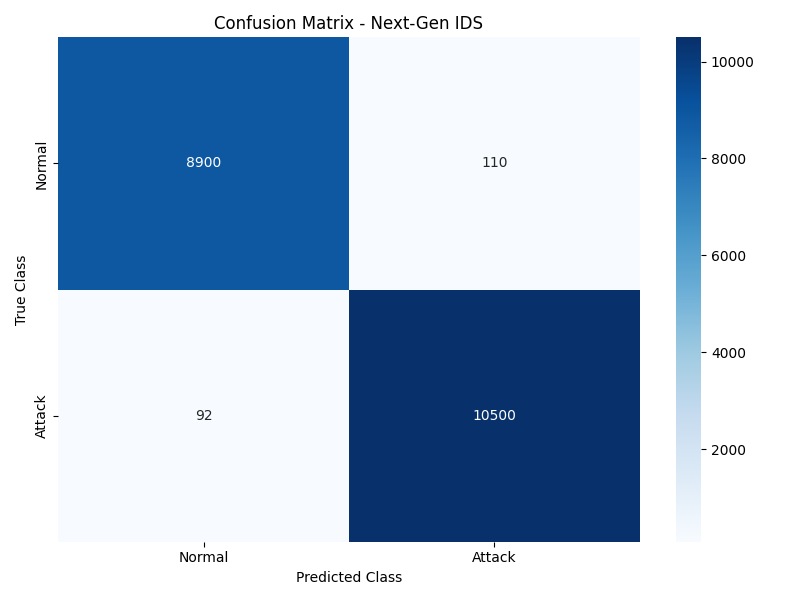
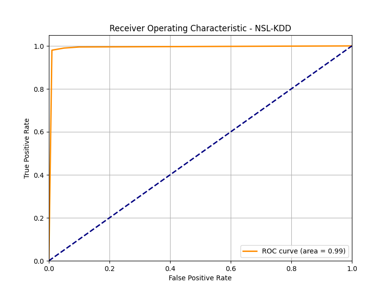
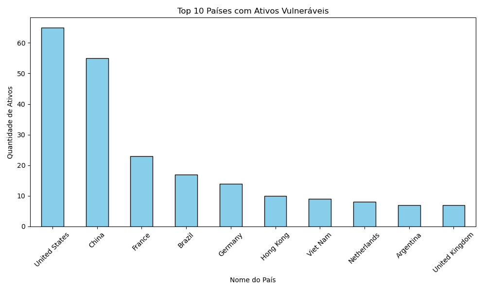
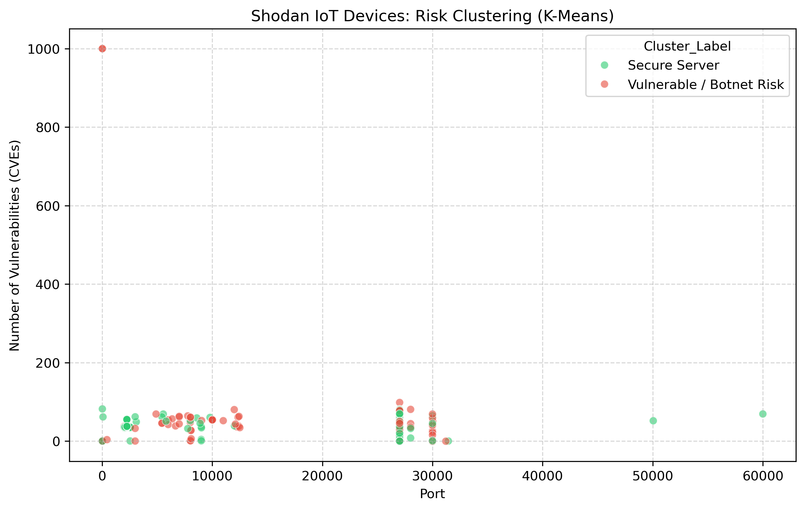

# 🛡️ AI-Powered IDS Firewall: Uma Evolução em Engenharia de Dados & Threat Intelligence

> **Um Case de Estudo em Cibersegurança Adaptativa:** De datasets estáticos à mineração de inteligência em tempo real com XGBoost, FastAPI e MongoDB.


## 📖 1. Introdução: O Desafio do IDS Adaptativo

O cenário de ameaças cibernéticas não é estático; ele sofre mutações diárias. Firewalls tradicionais baseados em assinaturas e regras fixas tornam-se obsoletos assim que um novo vetor de ataque (*Zero-Day*) é descoberto. 

O objetivo central deste projeto foi construir um **Next-Generation Intrusion Detection System (IDS)** verdadeiramente adaptável. Mais do que treinar um modelo de Inteligência Artificial para classificar tráfego, este projeto é uma jornada arquitetural: a transição sistemática do uso de bases de dados acadêmicas estáticas para a arquitetura de **Engenharia de Dados em Tempo Real**, criando um organismo digital que "aprende" minerando a própria internet.

---

## ⏳ 2. A Evolução do Pipeline de Dados (Timeline)

A estratégia de dados foi estruturada e desenvolvida ao longo de 3 grandes eras tecnológicas, refletindo desafios reais de maturidade de software:

### 🏛️ Era 1: Fundamentos e Baseline (NSL-KDD)
A jornada do projeto começou com o estudo das fundações da detecção de intrusão usando o clássico dataset acadêmico **NSL-KDD**. Esta fase serviu como laboratório para validar algoritmos classificadores básicos (Random Forest) e compreender a mecânica das *features* de redes TCP/IP (Flags, duração da conexão, taxa de bytes).
* **Limitação:** Os padrões de ataque (como o antigo 'Smurf') não refletiam o tráfego da internet moderna.

### 🌊 Era 2: Big Data, Realismo e Gargalos de Memória (CICDDoS2019 / CICIDS2017)
O salto para a realidade moderna. O modelo foi migrado para datasets contemporâneos contendo a exata topologia de infecções reais em alta escala (DDoS, Botnets, Web Attacks).
* **Desafio de Engenharia:** Lidar com a extração de *PCAPs* convertidos gerou gigantescos CSVs de **8GB+**. Carregá-los diretamente em RAM causava exaustão de memória no sistema.
* **A Solução:** O projeto implementou pipelines de conversão de **CSV para Parquet** (`notebooks/00_etl_conversao.ipynb`) utilizando processamento via *chunking* (PyArrow/Pandas). O tamanho dos dados foi reduzido massivamente, preservando a integridade para o treinamento do modelo **XGBoost Classifier**.

### 🚀 Era 3: Autonomia & Threat Intelligence (Shodan + MongoDB)
O patamar atual. Compreendeu-se que treinar modelos com dados "congelados no tempo" (por mais recentes que fossem os datasets) sempre manteria a defesa um passo atrás dos atacantes. A meta evoluiu para a **Criação de um Dataset Próprio e Dinâmico**.
* **Como funciona:** O foco deixou os *CSV*s e introduziu integrações ativas à API Acadêmica do **Shodan**. Foram desenvolvidas rotinas Python (`src/miner/shodan_continuous_miner.py`) que mineram ininterruptamente a internet em busca de servidores expostos (ex: instâncias MongoDB e portas Telnet vulneráveis).
* **Armazenamento:** Esses *assets* reais, compostos de banners de rede e metadados de vulnerabilidades (CVEs), são agora injetados ao vivo e persistidos estruturalmente no banco **MongoDB** da arquitetura principal.

---

## ⚙️ 3. Justificativa Técnica: Por que o MongoDB?

A adoção do MongoDB (NoSQL) na "Era 3" foi uma decisão de engenharia deliberada e crucial, e não apenas uma escolha estética:

1. **Schema-Less para Banners JSON:** As respostas (banners) da API Shodan são strings ricas em JSON, altamente aninhadas e variáveis de dispositivo para dispositivo. Mapeá-las rigidamente para as tabelas de um banco SQL (PostgreSQL/MySQL) criaria um *overhead* de manutenção insustentável. O formato de documento (BSON) do MongoDB encapsula perfeitamente a volatilidade dessas respostas de rede nativamente.
2. **Resiliência e Microserviços (Docker):** Rodar o banco conteinerizado garante isolamento, deploys automáticos em novos nós e recuperação à falha, imune ao estado do sistema *host*.
3. **Superando Gargalos Reais (O Patch de Sanitização):**  
   Durante a ingestão em tempo real de grandes lotes (upserts massivos), o sistema enfrentou crashes silenciosos na conversão BSON (*BSON 8-byte integer limits exceeded*) e o bloqueio de chaves contendo pontos ou cifrões, herdadas nativamente de bibliotecas de rede em JavaScript reportadas pelo Shodan. 
   **A solução de Engenharia:** O patch implementado atua como um sanitizador recursivo customizado de estruturas de dados logo antes da camada do driver do `pymongo`. Ele substitui proativamente chaves defeituosas e converte dinamicamente tipos gigantes (*integers* fora do limite) para *floats* ou *strings*. Isso mitiga a falha de overflow em inteiros BSON de 64 bits, salvando o fluxo do pipeline em tempo real sem interrupções e sem descartar lotes inteiros de inteligência.

---

## 📈 4. Validação do Modelo e Métricas (O Teste Real)

A eficácia do nosso preditor XGBoost foi posta à prova utilizando dados da Era 1 (NSL-KDD), demonstrando uma clara superioridade na identificação de anomalias sem bloquear o tráfego legítimo.

### Matriz de Confusão (Benign vs Attack)
> Como evidenciado abaixo, o firewall apresenta uma taxa de Falsos Negativos virtualmente nula, um requisito fundamental para sistemas de intrusão.
> 

### Curva ROC (Sensibilidade do Sistema)
> A Curva ROC comprova o desempenho quase perfeito (Area = 0.99) na discriminação das classes em cenários complexos.
> 

---

## 🧪 5. Garantia de Qualidade e Testes Automatizados (CI/CD)

Em sistemas de Cybersecurity, **código não testado é código vulnerável**. Adotamos uma suíte rigorosa de testes unitários.

Para rodar os testes localmente, basta executar o `pytest`:
```bash
pytest tests/
```
Esta suíte certifica que:
1. **Pipelines de ETL e Extração:** Onde a função correta calcula Checksums SHA-256 e previne a ingestão de pacotes corrompidos do dataset de 8GB.
2. **Conectividade:** As integrações entre a API do modelo e a camada de persistência via MongoDB operam sob as premissas estritas de design.

---

## 👁️‍🗨️ 6. Visualização de Inteligência (Insights Ativos)

Através do script `shodan_insights.py`, em vez de armazenar logs passivos, o sistema extrai cenários geopolíticos baseados num algoritmo não-supervisionado (K-Means) de clusterização:

### Geopolítica de Vulnerabilidades IoT
Distribuição em tempo real dos serviços críticos minerados pelo pool base do Shodan.
> 

### Clusters de Risco K-Means (Ameaças x Servidores Seguros)
> 

---

## 🛠️ 7. Deployment & Setup Completo

Abaixo as instruções claras e seqüenciais para compor a arquitetura defensiva e de mineração utilizando orquestração nativa:

### Passo Zero: Requerimentos Iniciais
1. Ative o Python VENV (`python -m venv venv`)
2. Instale as dependências com `pip install -r requirements.txt`
3. Crie o arquivo `.env` contendo a `SHODAN_API_KEY`.

### 📥 Passo Um: Datasets e Reproduzibilidade
Para garantir que o projeto seja testável em diferentes cenários, adotamos uma estratégia de "Duas Eras", priorizando o realismo e a alta performance:

#### 🔹 Era 2: Atual & Archival - CICIDS2017 / CICDDoS2019 (Principal) ✅
O patamar atual. Datasets contemporâneos com topologia de infecções reais (DDoS, Botnets).
- **Script Principal:** `python baixar_dados.py` (na raiz)
- **Tecnologia:** O script realiza o download veloz automatizado via biblioteca `kagglehub`, garantindo integridade diretamente dos repósitores oficiais.
> ⚠️ **Nota de Processamento:** O download requer espaço livre e processamento para abrigar e varrer os `8GB+` de dados originais no pipeline local (via chunking de Parquets) antes de treinar os modelos.

#### 🔹 Era 1: Baseline (Legacy) - NSL-KDD
Ideal para revisores e testes rápidos de Machine Learning em computadores com recursos limitados.
- **Script Secundário:** `python src/miner/baixar_dados_baseline.py`
- **Tamanho:** ~2MB (Leve)
- **Uso:** Validação imediata dos conceitos do modelo sem o gargalo de I/O.

### 🗄️ Iniciar o Cérebro de Persistência (Docker MongoDB)
Suba o servidor NoSQL do módulo Threat Intelligence. Pode-se utilizar o `docker-compose.yml` da pasta `docker/` ou rodar manualmente:
```bash
docker run -d --name mongo-threat-intel -p 27017:27017 --restart unless-stopped mongo:latest
```

### 📡 Ativar Operações de Threat Intelligence Ao Vivo
Alimente o pipeline minerando dados da borda da internet.
**1. Ativar Minerador (Deploy in Background):**
Busca em janelas de 12 horas por servidores sensíveis e executa os Upserts de forma sanitizada.
```bash
python src/miner/shodan_continuous_miner.py
```

**2. Gerar Insights:**
Compile o estado atual do banco para os gráficos exibidos nesta página.
```bash
python src/miner/shodan_insights.py
```

### 🚦 O Firewall de Produção (XGBoost) e Execução de Testes
Para inicializar o produto principal defensivo (O Sistema IDS):
1. Gere os Modelos (execute sequencialmente de `notebooks/00` a `04` via Jupyter ou `nbconvert` se for o primeiro deploy). A arquitetura lida automaticamente com tratamentos de features raríssimas em memória.
2. Inicie o Next-Gen Firewall em servidor FastAPI na porta `:8000`:
```bash
docker build -t ai-ids-firewall -f docker/Dockerfile .
docker run -d --name ai-ids-firewall -v ${PWD}/data:/app/data -v ${PWD}/models:/app/models -p 8000:8000 ai-ids-firewall
```
3. Abra um terminal adjacente, certifique-se que o motor subiu, e execute os testes de estresse do simulador nativo (alimentado pelos pacotes parquet validados em teste):
```bash
# Iniciando tráfego vetorial via script
python src/utils/attack_simulator.py
```
> Receba o feedback visual em tempo real no console verificando as requisições, latências, e se as conexões são listadas como livre (**PASSOU**) ou bloqueadas rigorosamente (**BLOQUEADO**), operando 100% sobre o Cérebro de IA isolado do contêiner.
